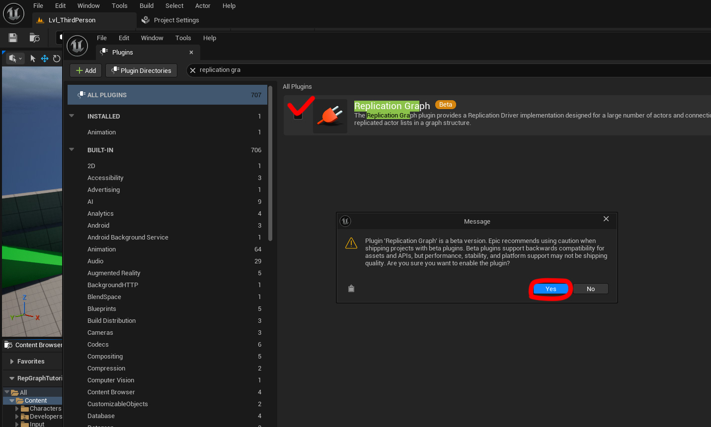

## **Building a Custom Replication Graph for Scalable Multiplayer in UE5**

**Network Replication for 100+ Players**

---

### **What is the Replication Graph?**

**Replication Graph** is a system in Unreal Engine that replaces the default replication logic. It controls **which actors get sent to which client connections**, giving you fine-grained control and scalable performance.

---

### **Key Feature**

The **killer feature** is **Grid Spatialization** — the world is divided into cells, and each client only receives actors that are **nearby**.
This dramatically reduces network and server load in large worlds with many players.

---

| Default Replication                      | Replication Graph                      |
| ---------------------------------------- | -------------------------------------- |
| All replicated actors are always checked | Only relevant actors are checked       |
| Same algorithm for every actor           | Fully customizable per actor type      |
| Higher CPU and network overhead          | More efficient & flexible architecture |
| Hard to scale beyond 64 players          | Supports 100+ players and open worlds  |

---

### **When Should You Use Replication Graph?**

| Use It If:                                 | You May Not Need It If:                 |
| ------------------------------------------ | --------------------------------------- |
| You have **32+ concurrent players**        | You have a small match with <16 players |
| You need **open worlds / level streaming** | You have a small arena map              |
| Your scene changes dynamically             | The scene is fixed/static               |
| You have many custom actor classes         | You only replicate a few known objects  |

---

## 🔧 **How to Set Up Replication Graph**

**Note:** Your project **must be C++** (it needs a `.sln` and `.Build.cs`).
If you have a Blueprint-only project, just create any empty C++ class to generate the solution.
Or start your test project using the **Third Person C++ template**.


---

### **Step 1️⃣: Enable Replication Graph**

* Open the **Plugins** window.
* Find **Replication Graph**, check it, accept the warning (it’s marked experimental), and restart the project.

  

> Technically, Replication Graph is not really a plugin — the checkbox simply enables the internal modules.
> If you skip this step, the system won't link the required modules.

Check your `.uproject` → there should be `ReplicationGraph` listed under `Plugins`.


---

### **Step 2️⃣: Create Your Custom Graph Class**

In the **Unreal Editor**, go to:

```
Tools → New C++ Class
```


Choose **All Classes**, search for `ReplicationGraph`, and create your custom class, e.g. `MyReplicationGraph`.


You’ll see it appear in your project files:


---

### **Step 3️⃣: Connect It to the Network Driver**

Open your `Config/DefaultEngine.ini`.
Add:

```ini
[/Script/OnlineSubsystemUtils.IpNetDriver]
ReplicationDriverClassName="/Script/YourProject.YourProjectReplicationGraph"
```

Replace `YourProject` with your module name and `YourProjectReplicationGraph` with your class name.


Also, add `ReplicationGraph` to `PublicDependencyModuleNames` in your `YourProject.Build.cs`:


✅ Now your custom Replication Graph is **linked** — but it won’t do anything yet because you haven’t defined any nodes.

---

### **Step 4️⃣: Test the Link**

Run the game in **Listen Server** mode (Net Mode: *Play As Listen Server*, with at least two players).


The clients won’t replicate anything yet — that’s expected!
Check the **Output Log** — you should see:

```
using replication model MyReplicationGraph
```


---

### **Step 5️⃣: Add Custom Graph Nodes**

To make your custom graph **work**, you must:

* Implement `InitGlobalGraphNodes()`
* Implement `RouteAddNetworkActorToNodes()`
* Optionally extend:

  * `UReplicationGraphNode_ActorList`
  * `UReplicationGraphNode_GridSpatialization2D`
  * `UReplicationGraphNode_AlwaysRelevant_ForConnection`

---

### **Example**

My template is based on:
[MazyModz - UE4-DAReplicationGraphExample](https://github.com/MazyModz/UE4-DAReplicationGraphExample)

---

**My structure includes custom actor base classes:**

* `DormantRepActor` [DormantRepActor.h](ReplicationGraphTemplate/DormantRepActor.h) \ [DormantRepActor.cpp](ReplicationGraphTemplate/DormantRepActor.cpp)
* `DynamicRepActor` [DynamicRepActor.h](ReplicationGraphTemplate/DynamicRepActor.h) \ [DynamicRepActor.cpp](ReplicationGraphTemplate/DynamicRepActor.cpp)
* `RelevantAllConnectionsActor` [RelevantAllConnectionsActor.h](ReplicationGraphTemplate/RelevantAllConnectionsActor.h) \ [RelevantAllConnectionsActor.cpp](ReplicationGraphTemplate/RelevantAllConnectionsActor.cpp)
* `StaticRepActor` [StaticRepActor.h](ReplicationGraphTemplate/StaticRepActor.h) \ [StaticRepActor.cpp](ReplicationGraphTemplate/StaticRepActor.cpp) 

Each inherits from `AActor` and is meant to be **parent classes** for your scene objects, enforcing clear replication policies.

---

**Spatial grid, culling distance, and update periods** are all configurable in `DefaultEngine.ini`.
Example:

```ini
[/Script/YourProject.YourProjectReplicationGraph]
CullDistanceForDynamic=30000.0
CullDistanceForStatic=10000
CullDistanceForDormancy=20000
ActorReplicationPeriodForDynamic=1
ActorReplicationPeriodForStatic=300
ActorReplicationPeriodForDormancy=10
GridCellSize=10000
SpatialBiasX=-15000
SpatialBiasY=-20000
```

---

## **Next Steps**

Once you connect your nodes and write your routing logic, your **custom Replication Graph** will:

* Divide the world into an efficient grid.
* Cull irrelevant actors.
* Scale to **100+ players** with stable performance.

---

**Enjoy building massive scalable multiplayer worlds in UE5!**